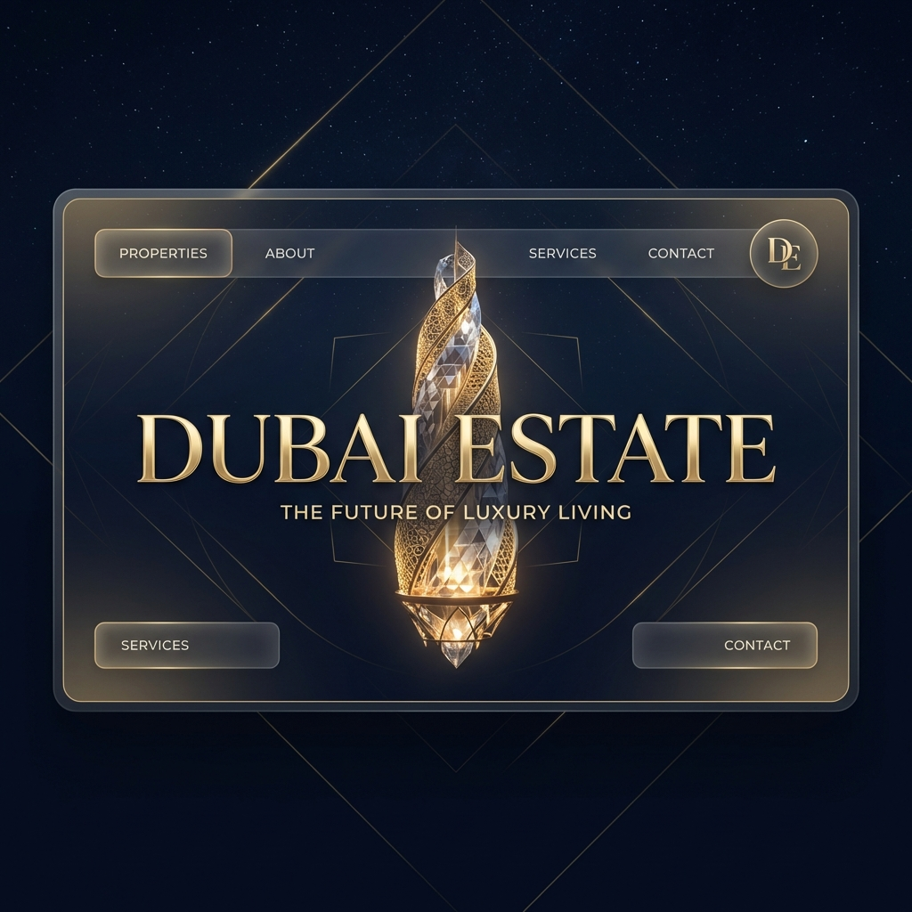

# Dubai Estate - Trillion Dirham Living

> "The future of luxury living."

## Overview

Dubai Estate is an ultra-luxury real estate platform designed to market high-end "Bed Space" and "Couple Sharing" units in Dubai. The application features a cinematic 3D experience with a procedurally generated gold and crystal tower, simulating a "Trillion Dirham" listing.

## Features

- **Immersive 3D Experience**: Integrating React Three Fiber for a rotating, light-refracting luxury tower.
- **Cinematic Visuals**: Post-processing effects including Bloom, Vignette, and Film Noise.
- **Glassmorphism UI**: Premium dark and gold aesthetics with glass-like interactive cards.
- **AI Concierge**: A simulated AI chatbot for instant property enquiries.

## Tech Stack

- **Framework**: Next.js 14+ (App Router)
- **Styling**: Tailwind CSS (Custom Gold/Midnight Theme)
- **3D Engine**: React Three Fiber / Three.js
- **Animation**: Framer Motion

## Getting Started

1.  Clone the repository.
2.  Run `npm install`.
3.  Run `npm run dev` to start the development server.

## License

Private Property of Dubai Estate.
